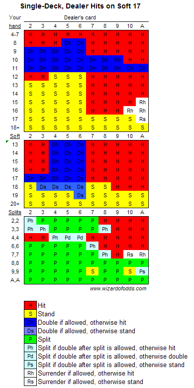

# Blackjack House Edge
Creators: 
- Alex De Meo
- Alan Cao
- Yufeng Liu, 101258905

# Logic
We loop through every possible player hand and dealer hand. With each possibility, we recursively calculate the expected value by following our strategy chart. The script takes roughly 30 minutes to run. 

# Rules
Single Deck
Blackjacks pay 3:2 
No surrender or insurance
Can double after splitting
Stand on Soft 17

# House Edge
We calculate the house edge to be around **0.59%**. Logically, this makes sense since the player has less variability when drawing cards, allowing them to play more precisely. The dealer still has the slight advantage, since it plays after the player so if the both the player and the dealer would've busted, the player loses.
This seems about right with online resources, they put the house edge at around 0.5%. The possible variance could be because we are not playing with surrendering or insurance. 

# Rules
## Player's Actions
1. Hit
2. Stand
3. Double
4. Split

## Deal order: 
1. Player's 1st card
2. Dealer's down card
3. Player's 2nd card
4. Dealer's up card

## Basic Strategy:


# File Structure
```bash
.
├── README.md
├── assets
│   ├── bj_1d_h17.gif
│   └── bj_1d_s17.gif
├── basic_strategy.py
├── cards.py 
├── dealerhit17.py 
├── dealerstand17.py
├── deck.py
├── hand.py
└── main.py
```
